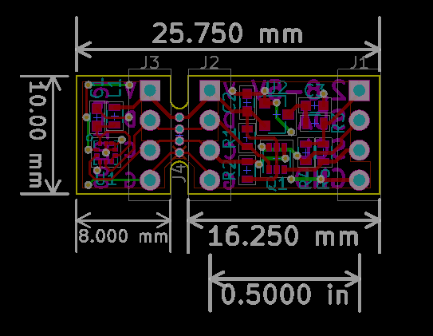
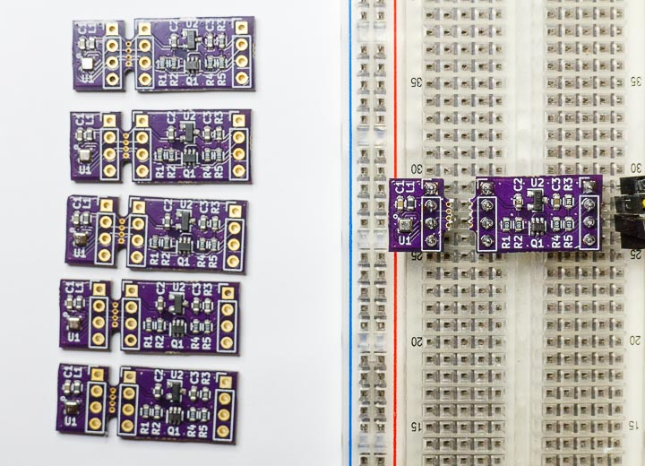

# ICP-101xx Library and Breakout Board

The TDK InvenSense ICP-101xx is a family of very low power, very high accuracy barometric pressure sensors. These sensors can measure pressure difference of as little as +/- 1 Pascal, which is equivalent to altitude differences of 8.5cm.


Documentation by TDK InvenSense:
* Product page: [TDK InvenSense](https://www.invensense.com/products/1-axis/icp-101xx/)
* Datasheet: [ICP-101xx](https://www.invensense.com/download-pdf/icp-101xx-datasheet/)
* Application Note: [Differential Pressure Sensing for Drones](https://www.invensense.com/download-pdf/an-000119-differential-pressure-sensing-using-icm-20789-for-altitude-hold-in-drones/)

## Arduino Library

The Arduino library ICP101xx provides a simple API to read temperature and pressure. The library was developed and tested with the ICP-10100 but should work with the other sensors of the family.

The library includes 3 examples that demonstrate its use.

### The ICP101xx Object

Use the `ICP101xx` object to create an instance of the sensor. For example, by declaring a global variable:

```
ICP101xx mysensor;
```

### begin()

To initialize the sensor, use the `begin` method.

```
mysensor.begin();
```

By default, the sensor will use the Arduino `Wire` object for I2C. If you want to use the sensor on a different I2C port, pass a pointer to the `Wire` object the library should use. For example:

```
mysensor.begin(&Wire1);
```

The `begin` method connects to the sensor and reads the calibration data. It will return `false`, if the sensor does not respond. This can be used for error handling.

```
if (!mysensor.begin()) {
	// sensor did not respond, do error handling here
}
```

### isConnected()

This method is used to check whether the sensor is responding. This method returns `true` if the sensor can be reached.

```
if (mysensor.isConnected()) {
	// do some measurements
} else {
	// report an error
}
```

`isConnected` will return false in the following situations:

- No response from the sensor. Check your connections and pull-up resistors.
- Sensor responds with an unknown or unsupported device ID.

### measure()

The method `measure` performs a measurement and doesn't return control until the measurement is completed.

The time to complete a measurement depends on the selected sensor mode that can be passed as an optional parameter. The options are:

|Mode|Duration|Noise|[Sensor Mode](http://www.invensense.com/wp-content/uploads/2019/02/DS-000186-ICP-101xx-v1.1.pdf#%5B%7B%22num%22%3A12%2C%22gen%22%3A0%7D%2C%7B%22name%22%3A%22XYZ%22%7D%2C34%2C530%2C0%5D)|Notes|
|--|--|--|--|--|
|FAST|3 ms|±3.2 Pa|Low Power (LP)| |
|NORMAL|7 ms|±1.6 Pa|Normal (N)|default|
|ACCURATE|24 ms|±0.8 Pa|Low Noise (LN)| |
|VERY_ACCURATE|95 ms|±0.4 Pa|Ultra Low Noise (ULN)| |

```
mysensor.measure(mysensor.VERY_ACCURATE);	// high accuracy measurement
// process data
```

If mode is not specified, NORMAL will be used.

```
mysensor.measure();	  // normal measurement
// process data
```

### measureStart(), dataReady()

Sometimes you may not want to wait idly until a measurement is complete but do something useful while the sensor is busy. Especially when using the VERY_ACCURATE mode, which takes almost 100ms to complete.

`measureStart` initiates a new measurement and immediately returns control to the calling program. Like the method `measure`, an optional parameter can be used to specify the accuracy. You can then use `dataReady` to check whether the sensor completed its task.

```
mysensor.measureStart(mysensor.VERY_ACCURATE);
while (!mysensor.dataReady()) {
	// do some other useful stuff
}
// the sensor is done, process the data
```

### getPressurePa()

When measurement is complete, the result is stored in the sensor object and can be read with the `getPressurePa` method.

`getPressurePa` returns the pressure in Pascal (Pa) as a `float`.

```
mysensor.measure();
Serial.print("Pressure is ");
Serial.print(mysensor.getPressurePa());
Serial.println(" Pa");
```

Pascal is mostly of interest to measure tiny pressure differences. For absolute pressure, you may want to apply some simple math.

|Target unit|Formula|
|--|--|
|hPa|Pa / 100|
|mbar|Pa / 100|
|mmHg|Pa / 133.322365|
|inHg|Pa / 3386.389|
|atm|Pa / 101325|

### getTemperatureC(), getTemperatureF()

The ICP-101xx also includes a very precise temperature sensor with an absolute accuracy of ±0.4 Celsius. The temperature is sampled together with the pressure during each measurement cycle. Use `getTemperatureC` or `getTemperatureF` to get the temperature as `float` in Celsius or Fahrenheit respectively.

```
mysensor.measure();
Serial.print("The current temperature is ");
Serial.print(mysensor.getTemperatureF());
Serial.println(" Fahrenheit");
```

## Breakout Board

This repository includes the schematic and layout files for a small breakout board in the extras/KiCad folder. 



The ICP-101xx is a 1.8V part, but the breakout board includes a voltage regulator and I2C level-shifter. This allows to interface the sensor to more common 2.8V, 3.3V or 5V logic.

The sensor can be separated from the rest of the breakout board, for example to put into confined and/or exposed spaces.



The breakout board was designed with Kicad 4.0.7. You can order the PCB on [OSH Park](https://oshpark.com/shared_projects/5VY0IcwY)


Soldering the sensor requires a solder paste stencil and a hot air gun or reflow oven.

Contact me if you are interested in buying populated and tested breakout boards.
